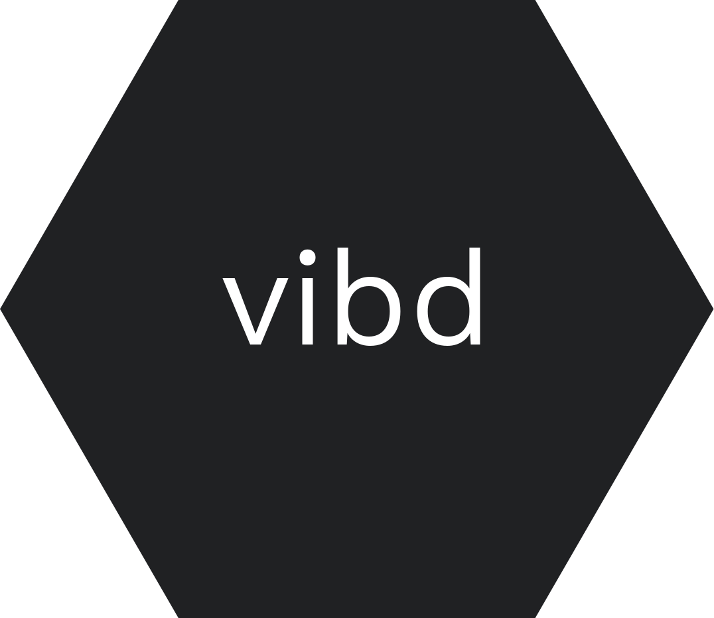

<h1 align="center">
  <br>
  <a href="https://github.com/vibedrive/vibedb">
    
  </a>
  <br>
</h1>


Kind of like [the beets cli](http://beets.readthedocs.io/en/v1.4.6/reference/cli.html) but [distributed](https://github.com/mafintosh/hyperdb) and usable in both node.js and [the browser](https://github.com/browserify/browserify).

You can track progress towards v1 [here](https://github.com/vibedrive/vibd/issues/1).

**See also:**
  - [vibd-traktor](https://github.com/vibedrive/vibd-traktor) - a vibd plugin

## table of contents

- [usage](#usage)
- [install](#install)
- [related](#related)
- [license](#license)


## usage

**cli:**
```
Usage: vibd 

commands:

  use
  import
  list
```

**js:**

```js
var os = require('os')
var path = require('path')
var Library = require('vibd')

var vibd = Library(path.join(os.homedir(), 'vibd'))
```

### use

register plugins

- cli: `vibd use <middleware>`
- js: `vibd.use(middleware)`

### import

import a collection. add support for collection type by middleware.

- cli: `vibd import (--format=<format>) [--payload=<payload>] `
- js: `vibd.import(opts) // opts = { source: { format, payload } }` 

### list

print items in library

- cli: `vibd list [<query>] [--sort=<sort>]`
- js: `vibd.items(query, sort, callback)`


## install 

with [npm](https://www.npmjs.com/)

globally: 
`npm install -g vibd`

as a module: 
`npm install vibd --save`


## related

- [beets](http://beets.readthedocs.io/)
- [hyperamp](https://github.com/hypermodules/hyperamp)
- [ipfs](https://github.com/ipfs/js-ipfs)
- [omi api spec](https://github.com/omi/api-specs)


## License

[Apache License 2.0](https://github.com/vibedrive/vibd/blob/master/LICENSE)
